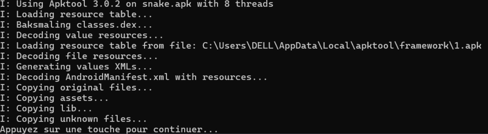
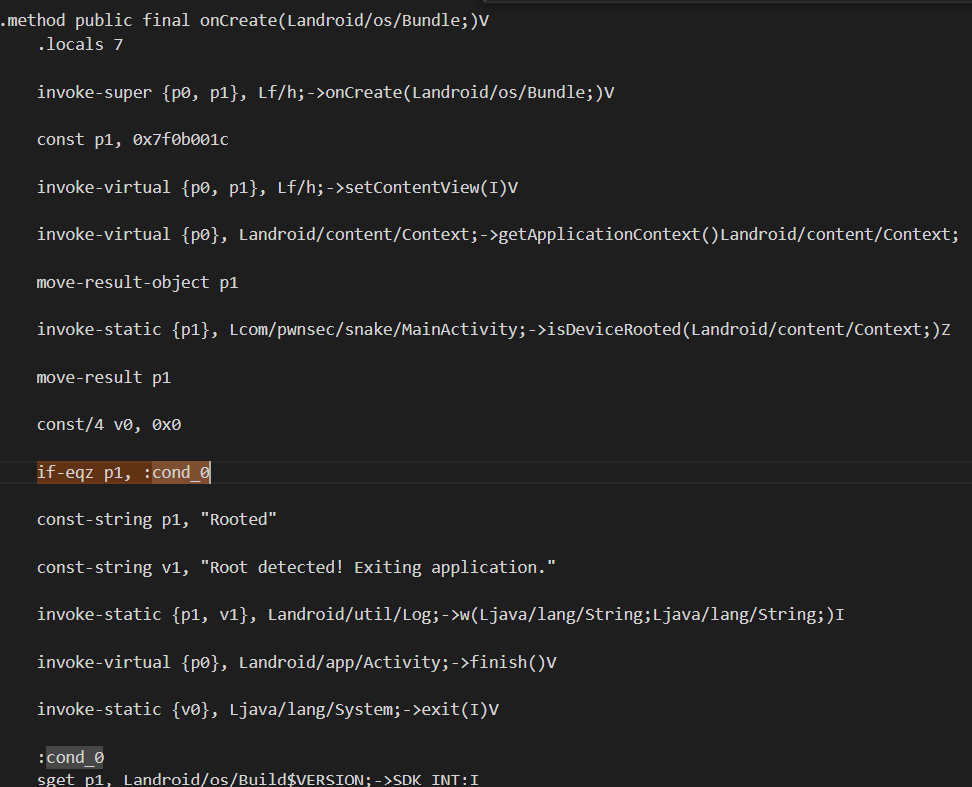
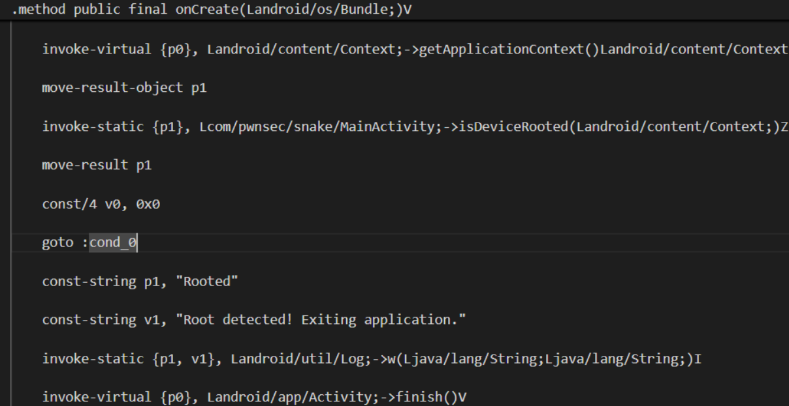
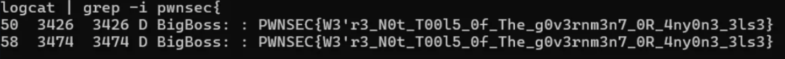

# 🐍 SnakeYAML Deserialization Challenge – README

      Objectif du challenge

L’application Android `snake.apk` implémente plusieurs mécanismes de protection anti-reverse (détection de root, d’émulateur et de Frida via une librairie native). Elle lit un fichier YAML depuis le stockage externe et le parse avec une version vulnérable de **SnakeYAML** (1.33, vulnérable à **CVE-2022-1471**).

Le but est d’exploiter cette désérialisation unsafe pour instancier une classe cachée `BigBoss`. Celle-ci charge une librairie native et, lorsqu’elle reçoit la bonne chaîne en paramètre, affiche le flag dans les logs (`logcat`).  
**Niveau : Hard** – pas de Frida possible (détections natives). La solution repose sur du **patching Smali** + une **payload YAML**.


         Outils utilisés

- `jadx-gui` – analyse statique du bytecode Java
- `apktool` – décompilation / recompilation Smali
- `apksigner` ou `uber-apk-signer` – signature de l’APK patché
- `adb` – interaction avec l’émulateur / périphérique
- Émulateur Android **API ≤ 28** (Android 9 ou moins)

---

## 📸 Captures d’écran et explications

### 1. Décompilation avec apktool



> **`1.png`** : Décompilation réussie de `snake.apk` avec apktool (chargement des ressources, baksmaling des classes).

### 2. Code Smali original (détection de root)



> **`2.png`** : Extrait de `MainActivity.smali` original. On voit le test de root (via `isDeviceRooted`) menant à `finish()` et `System.exit(0)`.

### 3. Patch Smali appliqué



> **`3.png`** : Après modification – le test de root est ignoré (`goto :cond_0`), l’application ne se ferme plus.

### 4. Flag récupéré dans logcat



> **`4.png`** : Flag affiché dans les logs Android après exploitation (`adb logcat | grep -i PWNSEC`).

### 5. Vérification du fichier YAML sur l’appareil


> **Capture d’écran** : Contenu du fichier `Skull_Face.yml` poussé sur l’émulateur via `adb push`, lu avec `cat`.

---

      Démarche suivie (étapes clés)
          
           1. Analyse statique avec jadx

Ouvrir `snake.apk` dans jadx-gui.  
On découvre :

- `MainActivity` : vérifie un extra Intent `SNAKE` valant exactement `"BigBoss"`.
- Si OK, lit `/sdcard/Snake/Skull_Face.yml` et parse le fichier avec `SnakeYAML`.
- La classe `com.pwnsec.snake.BigBoss` possède une méthode attendant la chaîne `"Snaaaaaaaaaaaaaake"` pour déclencher une fonction JNI qui loggue le flag.

### 2. Patch Smali pour bypasser les détections

```bash
apktool d snake.apk -o snake_smali
